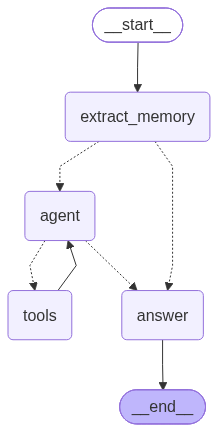
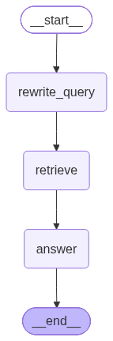

# MiniC

MiniC 是一个本地优先的 AI 知识助手（DeepAgent）：面向 Obsidian / Markdown 知识库做向量化存储与 RAG 检索，同时具备文件 / Git / 命令工具、会话与长期记忆、MCP / SKILL / 子智能体能力。所有数据都留在你自己的机器上，核心服务只监听 `127.0.0.1`。

MiniC 提供两种形态：

- **桌面端（推荐）**：从 [Releases](https://github.com/2528078765/MiniC/releases) 下载安装包，双击即用，无需命令行。
- **CLI**：源码运行，任意目录输入 `minic` 进入对话。

> English README: [README.en.md](README.en.md)

## 桌面端安装（v0.0.4）

### 方式一：安装包（推荐）

1. 前往 [Releases](https://github.com/2528078765/MiniC/releases) 下载 `MiniC-Setup-0.0.4.exe`（版本 0.0.4）。
2. 双击安装：自动创建开始菜单与桌面快捷方式，附卸载程序；默认装到用户目录（免管理员权限），也可选择安装给所有用户。
3. 安装完成后双击 MiniC 图标启动：**核心服务内嵌在桌面端进程内自动拉起**，不需要命令行、不需要单独启动任何服务。
4. 首次启动自动生成 `~/.minic/minic.json`（完整默认配置模板，含全部字段）——**无需手写配置**；进入「设置 → 模型设置」填写 Provider（供应商名称）、Base URL、模型、API Key 并保存即可对话（保存时核心若未启动完会自动等待；配置明文仅存本机，不入库、不上传）。
5. 知识库功能：同样在「模型设置 → Embedding」配置 Provider（langchain provider 名，如 `openai` / `ollama` / `azure_openai`，直接透传）、模型、Base URL（OpenAI 兼容端点）与 API Key。

### 方式二：绿色版（免安装）

- 下载 `MiniC-0.0.4-windows-x64.exe`，双击即用（不写注册表、无需安装）；其余使用方式同上。

### 安装包说明

- **只打包桌面端**：安装包内只有 MiniC 桌面程序（含内嵌核心服务），图标使用 [icon/Log.png](icon/Log.png)。
- 数据目录：`~/.minic/`（配置 `minic.json`、RAG 索引 `rag-data/`、记忆、日志），安装目录只放程序本体。

桌面端主要能力：

- 项目 → 工作区 → 会话三级树状管理，多会话并行流式对话。
- 内嵌设置：模型设置、知识库、记忆、技能、子智能体、MCP 服务器、使用统计。
- 模型下拉框随时切换供应商与模型；斜杠命令菜单（输入 `/`）支持 /压缩 /新建 /清空 /记忆 /知识库 /设置 /帮助。
- 知识库入库进度、使用统计（真实 token 消耗）、顶部通知条反馈、深色主题。

## 功能特性

- **RAG 知识库问答**：Markdown 知识库入库，Chroma 向量 + BM25 关键词混合检索（0.55 / 0.45 加权），回答带 `文件路径 + 章节` 来源；支持增量入库（未变文件跳过），`metadata.json` 是唯一事实来源；单库架构，数据统一存放在 `~/.minic/rag-data`。
- **本地工具与审批**：内置 Read / Write / Edit / TextSearch / Lint / Format / Bash / Git 全套工具；写操作先备份再执行、可回滚；敏感操作弹出审批。
- **会话与记忆**：多会话创建 / 恢复 / 压缩 / 归档 / 删除，破坏性操作前自动备份；长期记忆分全局与项目两级，个人信息自动写入全局记忆，项目约定写入项目记忆，自动去重、用户内容优先。
- **MCP 服务接入**：读取 `~/.minic/mcp/minic_mcp_settings.json`，外部 MCP 工具以 `server_name.tool_name` 注入工具注册表，失败指数退避重连。
- **SKILL 技能**：扫描用户级与项目级 `skills/*/SKILL.md`，frontmatter 声明能力与工具白名单，启用后注入上下文，`allowed-tools` 由工具调用层强制，审批是另一道闸。
- **子 Agent**：通过 `DelegateToSubagent` 或 `POST /agents` 委托子任务，独立上下文、并发与超时控制、长期记忆只读注入、审批按子任务透传。
- **教科书式 ReAct**：动作子图 `记忆提取 → agent ⇄ tools → 回答` 图上回边，原生工具调用，短期记忆保留 `human → ai(tool_calls) → tool` 标准结构。
- **崩溃恢复**：工具执行 `intent/result` 日志 + 幂等键，核心重启标记未完成 run 为 `interrupted`，不自动重放，用户消息收到后立即落盘。
- **中间件**：PII 脱敏、限流、请求日志、长期记忆注入、模型网络错误重试、上下文过长自动摘要。

## LangGraph 图预览

MiniC 的总图由 LangGraph 编排：`route` 路由节点按意图分流到知识子图或动作子图，动作子图为教科书式 ReAct 结构（图上回边循环）。

- 总图（route → knowledge / action）：[graph-super.png](graph-super.png)
- 总图（xray 展开子图）：[graph-super-xray.png](graph-super-xray.png)
- 动作子图（extract_memory → agent ⇄ tools → answer）：[graph-action.png](graph-action.png)
- 知识子图（问题改写 → 混合检索 → 回答）：[graph-knowledge.png](graph-knowledge.png)






## 环境要求

- Python 3.13 或更高版本（开发环境为 Python 3.14）。
- 默认模型走 DeepSeek（`deepseek-v4-flash`），embedding 走阿里云百炼（`text-embedding-v3`），两者都需要 API Key；Ollama 等本地服务可直接填 `127.0.0.1` 地址。
- API Key 放在用户级配置 `~/.minic/minic.json`，**不会进入项目仓库**（`.gitignore` 已排除）。配置模板见 [minic.example.json](minic.example.json)。
- CI 与单元测试使用 mock 模型与 mock embedding，不依赖外部服务，无需任何 Key。

## 源码安装

```powershell
cd MiniC
python -m venv .venv
.\.venv\Scripts\Activate.ps1
python -m pip install -e ".[dev]"
```

## 桌面端开发运行

```powershell
cd MiniC
.\.venv\Scripts\python.exe -m minic.gui.app
```

桌面端会自动在进程内拉起核心服务；若已有核心在运行则直接复用。指定工作区：`-m minic.gui.app --workspace D:\你的工作区`。

打包（PyInstaller 单文件 exe，产物 `dist/MiniC.exe`）：

```powershell
.\.venv\Scripts\python.exe scripts\make_icon.py          # 生成 icon/Log.ico
.\.venv\Scripts\pyinstaller.exe packaging\MiniC.spec --noconfirm --clean
ISCC.exe packaging\MiniC.iss                             # 生成安装包 dist\MiniC-Setup-0.0.4.exe（Inno Setup 6）
```

## CLI 使用

### 全局命令安装 / 卸载

激活 venv 后执行一次全局安装（幂等，重复执行不会重复添加），之后任意窗口、任意路径都可以直接使用 `minic`：

```powershell
cd MiniC
powershell -ExecutionPolicy Bypass -File .\scripts\install-global.ps1
```

- 安装后**完全关闭并重开终端应用**（脚本会广播环境变更，新终端生效）。
- 任意路径直接 `minic` 时：核心未运行会自动启动（数据目录回退到可写位置），退出时关闭本次启动的核心；核心已运行则直接复用。

卸载全局命令：

```powershell
powershell -ExecutionPolicy Bypass -File .\scripts\install-global.ps1 -Uninstall
```

### 配置 API Key

首次使用前把 API Key 写入用户级配置 `~/.minic/minic.json`（参考 [minic.example.json](minic.example.json)，复制后填写 Key）。支持多模型配置（桌面端「模型设置」会读写同一份配置）：

```json
{
  "model": {
    "models": [
      {
        "name": "DeepSeek",
        "provider": "deepseek",
        "base_url": "https://api.deepseek.com",
        "model": "deepseek-v4-flash",
        "api_key": "sk-deepseek-xxx",
        "enabled": true
      }
    ]
  },
  "embedding": { "api_key": "sk-dashscope-xxx" }
}
```

### 常用命令

```powershell
minic                                            # 进入会话（自动启动/复用核心）
minic --workspace D:\你的工作区                  # 指定工作区
minic serve                                      # 显式启动核心服务
minic status                                     # 检查连接状态
minic ingest D:\知识库\我的笔记                  # 知识库入库
minic query "MiniC 的架构是什么" --top-k 10      # 单次检索
minic chat --path D:\知识库\我的笔记             # 会话（先自动入库）
minic threads                                    # 会话列表
minic resume <thread_id>                         # 恢复会话
minic compress <thread_id>                       # 压缩会话
minic archive <thread_id>                        # 归档会话
minic delete <thread_id>                         # 删除会话
minic memory get --scope merged --workspace .    # 读长期记忆
minic memory set "用户偏好：中文" --scope project --workspace .
minic tool Read '{"path":"README.md"}'           # 手动执行工具
minic mcp                                        # MCP 服务状态
minic skills list                                # SKILL 列表
minic agent run "统计当前目录下所有 .py 文件的行数"
```

启动自动入库：在 `minic.json` 的 `rag.knowledge_base_paths` 配置一个或多个知识库路径（文件或目录均可；默认空数组 = 不开启），核心每次启动时后台增量入库这些路径（未变文件跳过，新增/修改文件重新入库），不阻塞启动；结果逐路径记录到 `<project>/.minic/logs/auto_ingest.jsonl`。

对话总结入库：配置 `rag.default_directory`（默认知识库目录）后，Agent 可在对话中「先 Write 写 Markdown 总结到知识库目录，再调 IngestDirectory 工具增量入库」。IngestDirectory 调用会中断审批（允许一次/始终允许/拒绝），拒绝后返回「用户拒绝入库」；`sandbox.allowed_write_dirs` 可配置允许 Write/Edit 写入的工作区外目录（默认含 `rag.default_directory`，仍走审批）。

## 会话内命令

`minic chat` / `minic` 会话内支持以下命令（均支持中文别名）：

| 命令 | 说明 |
| --- | --- |
| `/help`、`/帮助`、`/`、`?` | 显示命令列表 / 快捷键帮助 |
| `/new`、`/新建`、`/clear`、`/清空` | 归档当前会话并新建（先备份） |
| `/resume`、`/恢复` | 会话列表面板，按编号或 thread_id 恢复 |
| `/compress`、`/压缩` | 压缩当前会话，压缩前备份，可回滚 |
| `/memory`、`/记忆` | 长期记忆面板（全局 / 项目 / 合并） |
| `/rag`、`/知识库` | RAG 状态面板（文档数 / 分块数 / embedding / 最近入库时间） |
| `/settings`、`/设置` | 查看当前模型与 embedding 配置 |
| `/skills`、`/mcp`、`/agent` | 技能 / MCP 服务 / 子 Agent 状态面板 |
| `/quit`、`/退出` | 退出会话 |

## 工具与审批

内置工具注册表（对话中模型自动调用，也可用 `minic tool` 手动执行）：

| 工具 | 说明 | 权限 |
| --- | --- | --- |
| `Read` / `ReadMemory` / `TextSearch` / `Lint` | 读文件 / 读记忆 / 全文搜索 / 语法检查 | 只读 |
| `GitStatus` / `GitDiff` / `GitLog` | 查看 Git 状态 / 差异 / 日志 | 只读 |
| `Write` / `Edit` / `Format` | 写文件 / 增量编辑 / 格式化 | 写 |
| `GitCommit` / `GitBranch` | 提交改动 / 新建分支 | 写 |
| `Bash` | 执行终端命令 | 执行（full 权限） |
| `IngestDirectory` | 把目录内容增量写入知识库 | 写 |
| `DelegateToSubagent` | 委托子任务给子 Agent | 执行 |

审批规则：

- 只读工具在工作区内**自动放行**；工作区外读取需要确认。
- 写操作需要审批，支持四种决策：
  - `allow_once`：本次放行，不落盘。
  - `allow_session`：当前会话放行，不落盘。
  - `allow_always`：写入 `permissions.json` 持久化。
  - `deny`：拒绝执行；同作用域下 `deny` 优先于 `allow_always`。
- **Bash 必须人工审批**，审批菜单只提供 `allow_once` / `deny`，提交 `allow_always` / `allow_session` 会返回校验错误。
- 所有写操作与 `Format` 执行前会把目标文件备份到 `<project>/.minic/backups/`，可回滚。
- 工具输出与日志中的 API Key、手机号、身份证号等敏感信息会被 PII 脱敏。

## MCP 服务接入

MCP 服务配置位于用户级 `~/.minic/mcp/minic_mcp_settings.json`：

```json
{
  "mcpServers": {
    "roymcp": {
      "transport": "streamable-http",
      "url": "http://127.0.0.1:8000/mcp",
      "timeout": 60,
      "disabled": false,
      "autoApprove": [],
      "headers": {}
    },
    "local-tool": {
      "transport": "stdio",
      "command": "npx",
      "args": ["-y", "@some/local-mcp-server"],
      "env": {},
      "timeout": 60,
      "disabled": false,
      "autoApprove": []
    }
  }
}
```

- 已连接服务的工具以 `server_name.tool_name` 注册进工具注册表，`/tools/run` 与对话工具调用均可执行。
- `disabled: true` 的服务不连接；连接失败按 0.5s / 1s / 2s 指数退避重连，超过上限标记不可用，可手动重连。
- `autoApprove` 列表内的工具免审批（支持 `server.*`、`*` 通配符），其余 MCP 工具走现有审批流程。
- 接口：`GET /mcp` 查看服务状态；`POST /mcp/{name}/connect` 手动重连。CLI 内 `/mcp` 面板与 `minic mcp` 命令可查看状态。
- `headers` 字段支持直接写入密钥，但会以明文保存在配置文件中，**请勿将含密钥的配置文件提交到代码仓库**。

## SKILL 技能

SKILL 存放于用户级 `~/.minic/skills` 与项目级 `<project>/.minic/skills`，结构为 `skills/<skill-name>/SKILL.md`：

```markdown
---
name: guard
description: 项目守卫技能，涉及敏感操作前提醒
when_to_use: 项目内文件操作、提交前
allowed-tools:
  - Read
  - Write
---
正文：技能的详细说明……
```

- 启动时扫描两级 `SKILL.md`，解析 frontmatter 的 `name` / `description` / `when_to_use` / `allowed-tools`；无 frontmatter 或缺少 `name` 的文件被跳过。
- 同名冲突时项目级优先，首次启用需要确认（`POST /skills/{name}/enable` 返回 409，带 `{"confirm": true}` 确认后启用）。
- 启用状态持久化在 `<project>/.minic/skills_state.json`。
- 启用且 `when_to_use` 命中时，SKILL 的名称与描述注入模型上下文；`allowed-tools` 由工具调用层强制执行（白名单之外的工具直接拒绝），**审批是另一道闸，两道都必须通过**。
- 接口：`GET /skills`、`POST /skills/{name}/enable`、`POST /skills/{name}/disable`。

## 子 Agent

- 通过内置工具 `DelegateToSubagent` 或 `POST /agents` 委托子任务。
- 每个子任务拥有独立的 `subagent_id` 与消息上下文，与主会话完全隔离（不读写主会话的短期记忆）。
- 长期记忆只读注入，子任务不触发记忆提取写入。
- 并发受 `subagent.max_concurrent`（默认 3）限制；超时受 `subagent.timeout_seconds`（默认 120s）限制。
- 子任务内部工具调用走现有审批，`approval_requested` 事件携带 `subagent_id` 字段（不新增事件名）。
- 接口：`POST /agents`（同步执行）、`GET /agents`（最近子任务列表）、`GET /agents/{subagent_id}`（单个状态）。

## 崩溃恢复

- 工具执行采用 `intent` / `result` 日志（`<project>/.minic/logs/tool_execution.jsonl`）：调用前写 `intent`，完成后写 `result`；`idempotency_key` 由 `thread_id + tool + args` 规范化 hash 生成。
- 核心重启时把没有 `result` 的 `intent` 标记为 `interrupted`，不自动恢复。
- 同 `run_id + tool_call_id` 已有结果时直接回放，不重复执行工具。
- 用户消息收到后立即落盘；GUI/CLI 通过 `/health` 的 `pid` / `started_at` 检测核心重启。
- `/chat/stream` 的 SSE 事件按 `id=run_id:seq` 追加写入 `<project>/.minic/logs/sse_events.jsonl`（事件中的 args/token 先做 PII 脱敏），run 结束后保留 24 小时、下次启动清理；断线后可用 `GET /chat/stream/{run_id}/events` 回放续传，`POST /chat/stream/{run_id}/cancel` 取消当前流。核心重启后未完成 run 标记为 `interrupted`，不自动恢复。
- 总图挂载 LangGraph `MemorySaver` 内存 checkpointer：图状态在运行期内可恢复，但仅作为运行时可恢复状态，可由消息 JSON 与工具执行日志重建，不作为唯一事实来源；审批中断仍为现有 `asyncio.Event` 内存机制。

## 接口

核心服务只监听 `127.0.0.1`，除 `/health` 外均需要 `Authorization: Bearer <token>`，令牌由核心启动时生成并写入 `~/.minic/runtime.json`。统一错误格式为 `{"error": {"code", "message", "detail"}}`。

| 方法 | 路径 | 说明 |
| --- | --- | --- |
| GET | `/health` | 健康检查（无需鉴权），返回 pid / started_at / version |
| POST | `/chat/stream` | 发送消息，SSE 流式返回 |
| GET | `/chat/stream/{run_id}/events` | 回放 run 的 SSE 事件（last_event_id 续传，run 进行中实时转发直到 done） |
| POST | `/chat/stream/{run_id}/cancel` | 取消运行中的流（发送 message_end/done 为 cancelled 后关闭） |
| GET | `/threads` | 当前工作区会话列表（支持归档过滤、分页） |
| POST | `/threads/{id}/resume` | 恢复会话并返回消息记录 |
| POST | `/threads/{id}/compress` | 压缩会话（先备份） |
| POST | `/threads/{id}/archive` | 归档会话（先备份） |
| POST | `/threads/{id}/unarchive` | 恢复归档会话 |
| DELETE | `/threads/{id}` | 删除会话（先备份） |
| POST | `/threads/{id}/approve` | 提交审批结果（allow_once / allow_session / allow_always / deny） |
| GET | `/memory` | 查看长期记忆（scope=global / project / merged） |
| POST | `/memory` | 写入长期记忆（replace / merge，版本冲突返回 409） |
| POST | `/rag/ingest` | 文件 / 文件夹入库 |
| GET | `/rag/query` | 混合检索（q / top_k / source） |
| GET | `/rag/status` | 入库与索引状态 |
| GET | `/rag/documents` | 已入库文档列表（source 过滤、cursor/page_size 分页） |
| DELETE | `/rag/documents?path=` | 按知识库路径删除该库全部已入库文档 |
| DELETE | `/rag/documents/{doc_id}` | 删除已入库文档（同步清理 Chroma/BM25/metadata） |
| POST | `/tools/run` | 执行工具，SSE 返回 tool_call / approval_requested / approval_result / tool_result / done |
| GET | `/permissions` | 查看持久化权限（scope=global / project） |
| DELETE | `/permissions/{id}` | 撤销持久化权限 |
| GET | `/settings` | 读取合并后的设置（不含 API Key） |
| PUT | `/settings` | 局部更新设置并持久化到 minic.json（嵌套合并、数组替换） |
| GET | `/usage` | Token 消耗统计 |
| GET | `/backups` | 备份清单（session / file） |
| POST | `/backups/{id}/restore` | 恢复备份（会话回滚 / 文件恢复到原路径） |
| GET | `/mcp` | MCP 服务状态列表 |
| POST | `/mcp/{name}/connect` | 手动重连 MCP 服务 |
| GET | `/skills` | SKILL 列表（含 enabled / scope / conflict 标记） |
| POST | `/skills/{name}/enable` | 启用 SKILL（同名冲突需 confirm） |
| POST | `/skills/{name}/disable` | 禁用 SKILL |
| POST | `/agents` | 同步执行子 Agent 任务 |
| GET | `/agents` | 最近子任务列表 |
| GET | `/agents/{subagent_id}` | 单个子任务状态 |

`POST /chat/stream` 的 SSE 事件序列：`message_start` → `token` → `tool_call` →（`approval_requested` → `approval_result`）→ `tool_result` → `message_end` → `done`；`done` 事件的 `sources` 字段供展示 `文件路径 + 章节` 来源。

## 配置

配置合并规则：全局 `~/.minic/minic.json` 与项目 `<project>/.minic/minic.json` 合并，项目优先。完整字段见 [minic.example.json](minic.example.json)，复制到 `~/.minic/minic.json` 后填写 API Key：

```json
{
  "model": {
    "models": [
      {
        "name": "DeepSeek",
        "provider": "deepseek",
        "base_url": "https://api.deepseek.com",
        "model": "deepseek-v4-flash",
        "temperature": 0.7,
        "api_key": null,
        "enabled": true
      }
    ]
  },
  "embedding": {
    "provider": "openai",
    "base_url": "https://dashscope.aliyuncs.com/compatible-mode/v1",
    "model": "text-embedding-v3",
    "dimension": 1024
  },
  "rag": {
    "chunk_size": 500,
    "chunk_overlap": 100,
    "top_k": 5,
    "bm25_weight": 0.45,
    "vector_weight": 0.55,
    "default_directory": null,
    "knowledge_base_paths": []
  },
  "approval": {
    "workspace_read_auto_approve": true,
    "workspace_write_auto_approve": false,
    "expiry_seconds": 300
  },
  "sandbox": {
    "command_timeout": 60,
    "model_api_whitelist": [
      "http://127.0.0.1:11434",
      "api.deepseek.com",
      "dashscope.aliyuncs.com"
    ],
    "default_level": "workspace-write",
    "summarize_threshold_chars": 12000,
    "allowed_write_dirs": []
  },
  "memory": {
    "long_term_inject_threshold_tokens": 4000
  },
  "rate_limit": {
    "max_requests": 120,
    "window_seconds": 60
  },
  "subagent": {
    "max_concurrent": 3,
    "timeout_seconds": 120
  }
}
```

数据目录约定：

- 用户级 `~/.minic/`：`minic.json`（配置）、`runtime.json`（端口与访问令牌）、`rag-data/`（RAG 索引与 `metadata.json`，单库）、`memory/minic.md`（全局长期记忆）、`permissions.json`（全局授权）、`skills/`（全局 SKILL）、`mcp/minic_mcp_settings.json`（MCP 配置）、`logs/core.log`（桌面端内嵌核心日志）。
- 项目级 `<project>/.minic/`：`minic.json`（项目配置）、`memory/minic.md`（项目长期记忆）、`memory/short_memory/`（会话短期记忆）、`backups/`（备份）、`logs/`（`tool_execution.jsonl`、`requests.jsonl`、`auto_ingest.jsonl`）、`permissions.json`（项目授权）、`skills_state.json`（SKILL 开关）。

## 测试

```powershell
cd MiniC
.\.venv\Scripts\python.exe -m pytest -q
```

测试覆盖核心服务、RAG、会话、长期记忆、工具与审批、崩溃恢复、中间件、MCP、SKILL、子 Agent、CLI 界面与桌面端。测试使用 mock 模型与 mock embedding、临时目录与 fixture，**不需要任何外部 API Key**，`git clone` 后即可直接运行。

## 开源说明

MiniC 采用 [MIT License](LICENSE)。

- 贡献指南见 [CONTRIBUTING.md](CONTRIBUTING.md)。
- 安全说明见 [SECURITY.md](SECURITY.md)。
- 示例知识库见 [examples/](examples/README.md)。
