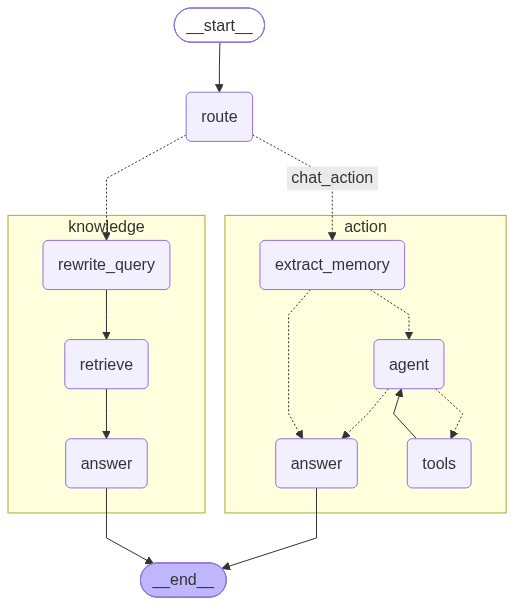

# MiniC

MiniC 是一个本地的 AI 知识助手（DeepAgent）：支持向量化存储与 RAG 检索（Markdown、PDF、TXT、JSON、HTML），同时具备文件 / Git / 命令工具、会话与长期记忆、MCP / SKILL / 子智能体能力。所有数据都留在你自己的机器上，核心服务只监听 127.0.0.1。

MiniC 提供桌面端：从 Releases 下载安装包，安装即用。

下载方式：[最新版本下载](https://github.com/2528078765/MiniC/releases/latest)（`MiniC-Setup-0.1.exe`，Windows 10/11 x64）

> English README: [README.en.md](README.en.md)

## 安装方式

1. 下载 `MiniC-Setup-0.1.exe`，双击安装：自动创建开始菜单与桌面快捷方式，附卸载程序；默认免管理员安装到用户目录，也可选择安装给所有用户。
2. 安装完成后双击 MiniC 图标启动：**核心服务内嵌在桌面端进程内自动拉起**，不需要命令行、不需要单独启动任何服务。
3. 首次启动自动生成 `~/.minic/minic.json`（完整默认配置模板，含全部字段）——**无需手写配置**；在设置里配置 API Key 后即可使用（见「配置 API Key」）。
4. 数据目录：`~/.minic/`（配置、RAG 索引、记忆、日志），安装目录只放程序本体。

## 功能特性

- **RAG 知识库问答**：向量化存储 + 混合检索，回答带来源（见「RAG」）。
- **本地工具与审批**：文件 / Git / 命令工具，写操作先备份、敏感操作审批（见「工具与审批」）。
- **会话与长期记忆**：多会话管理、压缩 / 归档 / 删除，记忆自动提取与去重。
- **MCP 服务接入**：外部工具以 `server_name.tool_name` 注入（见「MCP」）。
- **SKILL 技能**：技能描述注入上下文，工具白名单强制（见「SKILL」）。
- **子 Agent**：独立上下文委托子任务，并发与超时控制（见「子Agent」）。
- **崩溃恢复**：意图 / 结果日志 + 幂等键，中断 run 不自动重放（见「崩溃恢复」）。

## LangGraph 图预览

MiniC 的总图由 LangGraph 编排：`route` 路由节点按意图分流到知识子图或动作子图，动作子图为教科书式 ReAct 结构（图上回边循环）。



## 环境要求

- 桌面端（安装包）：Windows 10/11 x64，**无需安装 Python**。
- 源码运行：Python 3.13 或更高（开发环境为 Python 3.14），依赖见 `pyproject.toml`；安装后运行 `python -m minic.gui.app` 启动桌面端。
- 大模型与 Embedding 需要 API Key；Ollama 等本地服务免 Key。
- 单元测试使用 mock 模型与 mock embedding，不依赖外部服务。

## 配置 API Key

1. 打开 MiniC，进入「设置 → 模型设置」。
2. 大模型：点击「添加供应商」，填写 **名称**（自定义显示名）/ **Provider**（deepseek、openai、ollama…）/ **Base URL** / **模型** / **API Key**，保存。「测试连接」会用填写的模型名真实发一次对话请求验证（Key、模型名、端点任一错误都会显示原因并列出可用模型名）。
3. Embedding（知识库向量化）：同一面板下方填写 Provider（如 `openai` + 百炼兼容端点 `https://dashscope.aliyuncs.com/compatible-mode/v1`）、模型（如 `text-embedding-v3`）、Base URL、API Key，保存。
4. 配置明文保存在本机 `~/.minic/minic.json`（不入库、不上传）；也可以直接编辑该文件（首次启动已自动生成完整模板）。

## 命令介绍

在输入框输入 `/` 弹出命令菜单，↑↓ 选择、回车执行：

| 命令 | 作用 |
| --- | --- |
| `/压缩` | 压缩当前会话（压缩前备份，可回滚） |
| `/新建` | 归档当前会话并新建（先备份） |
| `/清空` | 归档当前会话并新建（先备份） |
| `/记忆` | 查看 / 编辑长期记忆 |
| `/知识库` | 打开知识库设置（路径、入库、检索、删除） |
| `/设置` | 打开设置 |
| `/帮助` | 显示命令帮助 |

## 工具与审批

内置工具注册表（对话中模型自动调用）：

| 工具 | 说明 | 权限 |
| --- | --- | --- |
| `Read` / `ReadMemory` / `TextSearch` / `Lint` | 读文件 / 读记忆 / 全文搜索 / 语法检查 | 只读 |
| `GitStatus` / `GitDiff` / `GitLog` | 查看 Git 状态 / 差异 / 日志 | 只读 |
| `Write` / `Edit` / `Format` | 写文件 / 增量编辑 / 格式化 | 写 |
| `GitCommit` / `GitBranch` | 提交改动 / 新建分支 | 写 |
| `Bash` | 执行终端命令 | 执行（full 权限） |
| `IngestDirectory` | 把目录内容增量写入知识库 | 写 |
| `DelegateToSubagent` | 委托子任务给子 Agent | 执行 |

审批规则：

- 只读工具在工作区内**自动放行**；工作区外读取需要确认。
- 写操作需要审批，支持四种决策：`allow_once`（本次放行）/ `allow_session`（当前会话放行）/ `allow_always`（写入 `permissions.json` 持久化）/ `deny`（拒绝，同作用域下优先于 allow_always）。
- **Bash 必须人工审批**（只提供 allow_once / deny）。
- 写操作与 `Format` 执行前把目标文件备份到 `<项目>/.minic/backups/`，可回滚。
- 工具输出与日志中的 API Key、手机号、身份证号等敏感信息会被 PII 脱敏。

## SKILL

SKILL 存放于用户级 `~/.minic/skills` 与项目级 `<项目>/.minic/skills`，结构为 `skills/<skill-name>/SKILL.md`：

```markdown
---
name: guard
description: 项目守卫技能，涉及敏感操作前提醒
when_to_use: 项目内文件操作、提交前
allowed-tools:
  - Read
  - Write
---
正文：技能的详细说明……
```

- 启动时扫描两级 `SKILL.md`，解析 frontmatter 的 `name` / `description` / `when_to_use` / `allowed-tools`；无 frontmatter 或缺少 `name` 的文件被跳过。
- 同名冲突时项目级优先，首次启用需要确认；启用状态持久化在 `<项目>/.minic/skills_state.json`。
- 启用且 `when_to_use` 命中时，SKILL 的名称与描述注入模型上下文；`allowed-tools` 由工具调用层强制执行，**审批是另一道闸，两道都必须通过**。
- 桌面端「设置 → 技能」可查看、开关、搜索与删除（删除前确认）。

## MCP

MCP 服务配置位于用户级 `~/.minic/mcp/minic_mcp_settings.json`：

```json
{
  "mcpServers": {
    "roymcp": {
      "transport": "streamable-http",
      "url": "http://127.0.0.1:8000/mcp",
      "timeout": 60,
      "disabled": false,
      "autoApprove": [],
      "headers": {}
    },
    "local-tool": {
      "transport": "stdio",
      "command": "npx",
      "args": ["-y", "@some/local-mcp-server"],
      "env": {},
      "timeout": 60,
      "disabled": false,
      "autoApprove": []
    }
  }
}
```

- 已连接服务的工具以 `server_name.tool_name` 注册进工具注册表，对话中可直接调用。
- 只写 `url` 不写 `transport` 默认按 streamable-http 连接；`disabled: true` 不连接；连接失败按 0.5s / 1s / 2s 指数退避重连。
- `autoApprove` 列表内的工具免审批（支持 `server.*`、`*` 通配符），其余 MCP 工具走审批流程。
- 桌面端「设置 → MCP 服务器」可查看状态与开关；改配置文件后点刷新即时生效（无需重启）。
- `headers` 字段支持直接写入密钥，但会以明文保存在配置文件中，**请勿将含密钥的配置文件提交到代码仓库**。

## 子Agent

- 通过内置工具 `DelegateToSubagent` 委托子任务。
- 每个子任务拥有独立的 `subagent_id` 与消息上下文，与主会话完全隔离（不读写主会话的短期记忆）。
- 长期记忆只读注入，子任务不触发记忆提取写入。
- 并发受 `subagent.max_concurrent`（默认 3）限制；超时受 `subagent.timeout_seconds`（默认 120s）限制。
- 子任务内部工具调用走现有审批，`approval_requested` 事件携带 `subagent_id` 字段。

## RAG

- **入库**：支持 Markdown（PDF / TXT / JSON / HTML 支持在路线图中）；按标题切分章节 + 滑窗分块（`chunk_size` 500 / `chunk_overlap` 100），增量入库（内容未变化的文件跳过），`metadata.json` 是唯一事实来源。
- **检索**：Chroma 向量 + BM25 关键词混合检索（0.55 / 0.45 加权），问题自动改写，回答带 `文件路径 + 章节` 来源。
- **单库架构**：数据统一存放在 `~/.minic/rag-data`（向量、BM25 索引、metadata 同目录）。
- **启动自动入库**：在 `minic.json` 的 `rag.knowledge_base_paths` 配置一个或多个知识库路径（文件或目录均可；默认空数组 = 不开启），每次启动后台增量入库，不阻塞启动。
- **对话总结入库**：配置 `rag.default_directory` 后，可让 Agent 写 Markdown 总结到知识库目录并调 `IngestDirectory` 增量入库（入库会中断审批，拒绝后返回「用户拒绝入库」）。
- **文档清单常驻**：已入库文档清单会常驻系统提示词，问「你都知道什么」会列出知识库中的文档名。

## 崩溃恢复

- 工具执行采用 `intent` / `result` 日志（`<项目>/.minic/logs/tool_execution.jsonl`）：调用前写 `intent`，完成后写 `result`；`idempotency_key` 由 `thread_id + tool + args` 规范化 hash 生成。
- 核心重启时把没有 `result` 的 `intent` 标记为 `interrupted`，不自动恢复；同 `run_id + tool_call_id` 已有结果时直接回放，不重复执行。
- 用户消息收到后立即落盘；`/chat/stream` 的 SSE 事件追加写入 `sse_events.jsonl`（PII 脱敏），断线后可用 `GET /chat/stream/{run_id}/events` 回放续传，`POST /chat/stream/{run_id}/cancel` 取消。
- 总图挂载 LangGraph `MemorySaver` 内存 checkpointer：图状态运行期内可恢复，可由消息 JSON 与工具执行日志重建，不作为唯一事实来源。

## 接口

核心服务只监听 `127.0.0.1`，除 `/health` 外均需要 `Authorization: Bearer <token>`，令牌由核心启动时生成并写入 `~/.minic/runtime.json`。统一错误格式为 `{"error": {"code", "message", "detail"}}`。

| 方法 | 路径 | 说明 |
| --- | --- | --- |
| GET | `/health` | 健康检查（无需鉴权），返回 pid / started_at / version |
| POST | `/chat/stream` | 发送消息，SSE 流式返回 |
| GET | `/chat/stream/{run_id}/events` | 回放 run 的 SSE 事件（last_event_id 续传，run 进行中实时转发直到 done） |
| POST | `/chat/stream/{run_id}/cancel` | 取消运行中的流 |
| GET | `/threads` | 当前工作区会话列表（支持归档过滤、分页） |
| POST | `/threads/{id}/resume` | 恢复会话并返回消息记录 |
| POST | `/threads/{id}/compress` | 压缩会话（先备份） |
| POST | `/threads/{id}/archive` | 归档会话（先备份） |
| POST | `/threads/{id}/unarchive` | 恢复归档会话 |
| DELETE | `/threads/{id}` | 删除会话（先备份） |
| POST | `/threads/{id}/approve` | 提交审批结果（allow_once / allow_session / allow_always / deny） |
| GET | `/memory` | 查看长期记忆（scope=global / project / merged） |
| POST | `/memory` | 写入长期记忆（replace / merge，版本冲突返回 409） |
| POST | `/rag/ingest` | 文件 / 文件夹入库 |
| GET | `/rag/query` | 混合检索（q / top_k / source） |
| GET | `/rag/status` | 入库与索引状态 |
| GET | `/rag/documents` | 已入库文档列表（source 过滤、cursor/page_size 分页） |
| DELETE | `/rag/documents?path=` | 按知识库路径删除该库全部已入库文档 |
| DELETE | `/rag/documents/{doc_id}` | 删除已入库文档（同步清理 Chroma/BM25/metadata） |
| POST | `/tools/run` | 执行工具，SSE 返回 tool_call / approval_requested / approval_result / tool_result / done |
| GET | `/permissions` | 查看持久化权限（scope=global / project） |
| DELETE | `/permissions/{id}` | 撤销持久化权限 |
| GET | `/settings` | 读取合并后的设置（不含 API Key） |
| PUT | `/settings` | 局部更新设置并持久化到 minic.json（嵌套合并、数组替换） |
| GET | `/usage` | Token 消耗统计 |
| GET | `/backups` | 备份清单（session / file） |
| POST | `/backups/{id}/restore` | 恢复备份（会话回滚 / 文件恢复到原路径） |
| GET | `/mcp` | MCP 服务状态列表 |
| POST | `/mcp/{name}/connect` | 手动重连 MCP 服务 |
| GET | `/skills` | SKILL 列表（含 enabled / scope / conflict 标记） |
| POST | `/skills/{name}/enable` | 启用 SKILL（同名冲突需 confirm） |
| POST | `/skills/{name}/disable` | 禁用 SKILL |
| POST | `/agents` | 同步执行子 Agent 任务 |
| GET | `/agents` | 最近子任务列表 |
| GET | `/agents/{subagent_id}` | 单个子任务状态 |

`POST /chat/stream` 的 SSE 事件序列：`message_start` → `token` → `tool_call` →（`approval_requested` → `approval_result`）→ `tool_result` → `message_end` → `done`；`done` 事件的 `sources` 字段供展示来源。

## 配置

配置文件 `~/.minic/minic.json`（首次启动自动生成完整模板；`minic.example.json` 为示例）。**model / embedding / rag 三段仅全局可改**（项目配置文件中写这三段会被忽略），其余段支持项目级覆盖（项目 `<项目>/.minic/minic.json` 优先）：

```json
{
  "model": {
    "models": [
      {
        "name": "DeepSeek",
        "provider": "deepseek",
        "base_url": "https://api.deepseek.com",
        "model": "deepseek-v4-flash",
        "temperature": 0.7,
        "api_key": "sk-...",
        "enabled": true
      }
    ]
  },
  "embedding": {
    "provider": "openai",
    "base_url": "https://dashscope.aliyuncs.com/compatible-mode/v1",
    "model": "text-embedding-v3",
    "dimension": 1024,
    "api_key": "sk-..."
  },
  "rag": {
    "chunk_size": 500,
    "chunk_overlap": 100,
    "top_k": 5,
    "bm25_weight": 0.45,
    "vector_weight": 0.55,
    "default_directory": null,
    "knowledge_base_paths": []
  },
  "approval": {
    "workspace_read_auto_approve": true,
    "workspace_write_auto_approve": false,
    "expiry_seconds": 300
  },
  "sandbox": {
    "command_timeout": 60,
    "model_api_whitelist": [
      "http://127.0.0.1:11434",
      "api.deepseek.com",
      "api.openai.com",
      "dashscope.aliyuncs.com",
      "api.moonshot.cn",
      "open.bigmodel.cn",
      "api.minimax.chat",
      "api.siliconflow.cn"
    ],
    "default_level": "workspace-write",
    "summarize_threshold_chars": 12000,
    "allowed_write_dirs": []
  },
  "memory": {
    "long_term_inject_threshold_tokens": 4000
  },
  "rate_limit": {
    "max_requests": 120,
    "window_seconds": 60
  },
  "subagent": {
    "max_concurrent": 3,
    "timeout_seconds": 120
  }
}
```

数据目录约定：

- 用户级 `~/.minic/`：`minic.json`（配置）、`runtime.json`（端口与访问令牌）、`rag-data/`（RAG 索引与 metadata）、`memory/`（长期记忆）、`skills/`（全局 SKILL）、`mcp/`（MCP 配置）、`permissions.json`（全局授权）、`logs/`（核心日志）。
- 项目级 `<项目>/.minic/`：`minic.json`（项目配置，不含 model/embedding/rag）、`memory/`（项目记忆与短期记忆）、`backups/`（备份）、`logs/`（工具执行 / 请求 / 自动入库日志）、`permissions.json`（项目授权）、`skills_state.json`（SKILL 开关）。

## 开源说明

MiniC 采用 [MIT License](LICENSE)。
